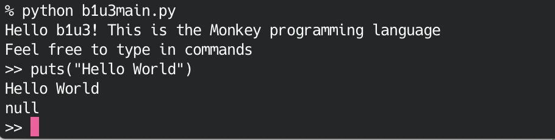

# PyMonkey

This is Writing An Interpreter In Go (https://interpreterbook.com/) implemented in Python3. is implemented in python. I'm using "b1u3" as prefix for embedded module and function name collision.

Thank you, Thorsten. It was good experience.

It doesn't implement macro system yet. I will later.

============================

Go言語でつくるインタプリタ(オライリージャパン)の python による実装です。python の組み込み関数、モジュールとの名前衝突のため、プリフィックスとして、b1u3 が付いています。

ありがとう Thorsten さん。面白かったです。

